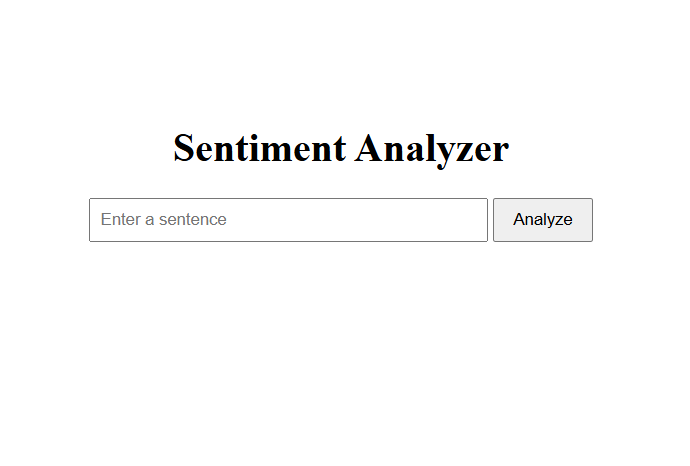
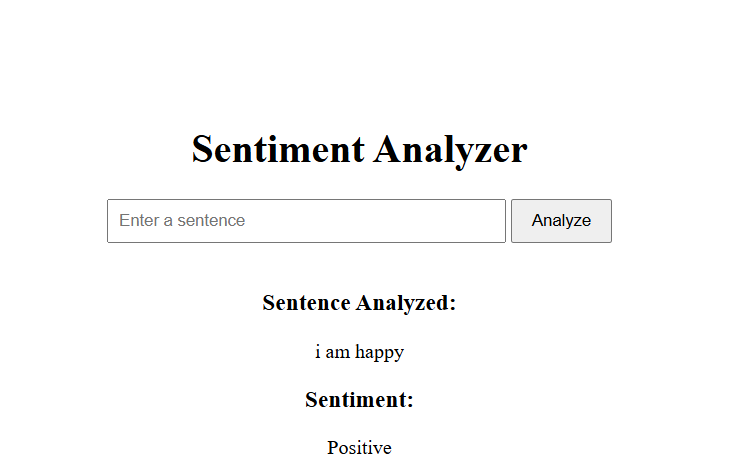
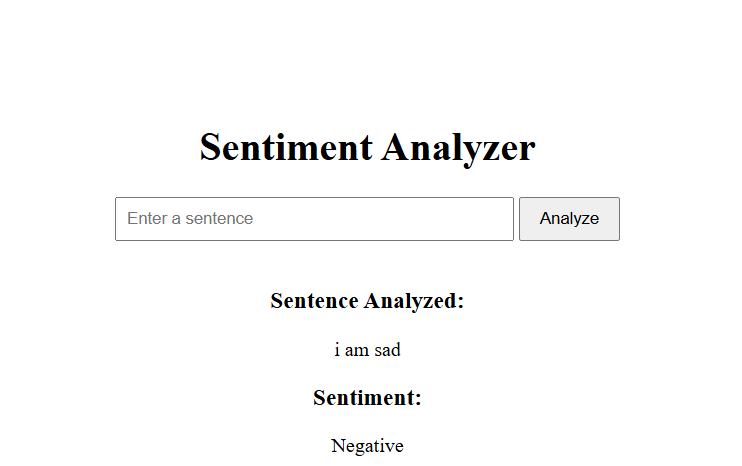

# Sentiment Analyzer

A simple web application built using Django and TextBlob that analyzes the sentiment of user-entered text and classifies it as Positive, Negative, or Neutral.

## Features

* Enter text through a web interface
* Analyze sentiment instantly
* Classify text as Positive, Negative, or Neutral
* Simple and user-friendly interface

## Technologies Used

* Python
* Django
* TextBlob
* HTML

## Installation

1. Clone the repository

```bash
git clone <repository-url>
cd SimpleSentiment
```

2. Install dependencies

```bash
pip install -r requirements.txt
```

3. Run the Django server

```bash
python manage.py runserver
```

4. Open your browser and visit

```text
http://127.0.0.1:8000/
```

## Screenshots

### Home Page



### Positive Sentiment



### Negative Sentiment



## Example

Input:

```text
i am happy
```

Output:

```text
Positive
```